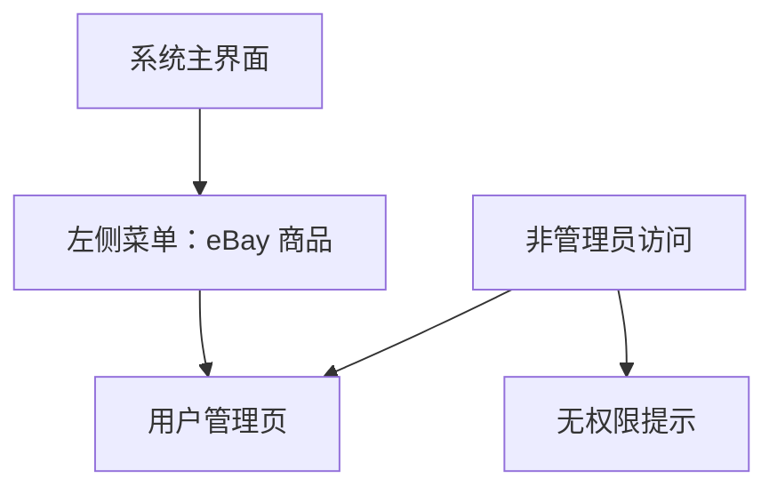

## 1. Product Overview
在左侧菜单“eBay 商品”下新增“用户管理”入口，提供用户列表查看、基础搜索与分页。
该页面仅管理员可访问，非管理员访问需被拦截并提示无权限。

## 2. Core Features

### 2.1 User Roles
| 角色 | 获取方式 | 核心权限 |
|------|----------|----------|
| 管理员 | 使用现有账号体系登录后，被识别为管理员 | 可访问“用户管理”页面；可查看用户列表、搜索、分页 |
| 非管理员 | 使用现有账号体系登录后，被识别为非管理员 | 不可访问“用户管理”页面；访问时被拦截并提示无权限 |

### 2.2 Feature Module
本次需求包含以下页面：
1. **用户管理页**：权限校验、用户列表、基础搜索、分页。

### 2.3 Page Details
| Page Name | Module Name | Feature description |
|-----------|-------------|---------------------|
| 用户管理页 | 入口与导航 | 在左侧菜单“eBay 商品”下新增“用户管理”菜单项；点击后进入用户管理页 |
| 用户管理页 | 权限校验 | 校验当前登录用户是否为管理员；非管理员禁止访问并提示无权限（可返回上一页/首页） |
| 用户管理页 | 用户列表 | 以表格形式展示用户基础信息（如：ID、邮箱/用户名、角色、状态、创建时间）；支持加载中/空态/错误态 |
| 用户管理页 | 基础搜索 | 支持按关键词搜索（如：邮箱/用户名）；支持清空搜索恢复默认列表 |
| 用户管理页 | 分页 | 支持翻页与每页条数（如固定 10/20/50）；展示总数或“第 N 页”状态（以现有组件规范为准） |

## 3. Core Process
- 管理员流程：登录系统 → 左侧菜单进入“eBay 商品” → 点击“用户管理” → 查看列表 → 输入关键词搜索 → 翻页浏览。
- 非管理员流程：登录系统 → 尝试通过菜单或直接访问用户管理路由 → 被拦截 → 提示无权限并引导返回。

