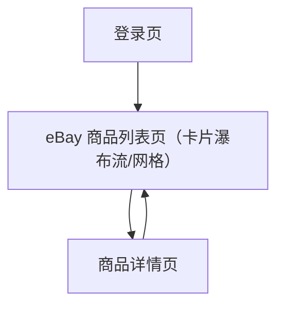

## 1. Product Overview
把现有 eBay 商品列表从表格改为卡片瀑布流/网格展示（图片、标题、价格、库存），点击卡片进入商品详情页。
保持后端接口与数据结构不变，仅做前端展示与路由交互升级。

## 2. Core Features

### 2.1 User Roles
| 角色 | 注册/登录方式 | 核心权限 |
|------|----------------|----------|
| 分销用户 | 账号密码登录 | 浏览商品列表/详情；查看价格与库存；从详情/列表进入下单相关动作（如已有） |
| 管理员 | 账号密码登录（管理员账号） | 具备分销用户权限；可触发 eBay 商品同步并查看同步状态（如已有） |

### 2.2 Feature Module
本需求涉及的最小可用页面如下：
1. **登录页**：账号密码登录、错误提示。
2. **eBay 商品列表页（卡片瀑布流/网格）**：搜索、分页、卡片展示（图/标题/价/库存）、点击进入详情、（可选）快速操作区（如已有）。
3. **商品详情页**：展示商品关键信息（图/标题/价/库存/SKU/eBay 链接）、返回列表。

### 2.3 Page Details
| Page Name | Module Name | Feature description |
|-----------|-------------|------------------|
| 登录页 | 登录表单 | 输入账号/密码并登录；展示校验与错误信息；登录成功进入应用 |
| eBay 商品列表页（卡片瀑布流/网格） | 视图容器 | 以瀑布流/网格方式渲染商品卡片；支持桌面优先布局并在小屏自动降列 |
| eBay 商品列表页（卡片瀑布流/网格） | 卡片内容 | 展示商品图片（接口无图片时使用默认占位图）、标题、价格（含币种）、库存（含低库存高亮） |
| eBay 商品列表页（卡片瀑布流/网格） | 进入详情 | 点击卡片或“查看详情”跳转详情页，并携带该商品数据用于详情渲染（不新增后端接口） |
| eBay 商品列表页（卡片瀑布流/网格） | 搜索与分页 | 按 SKU/标题搜索；分页翻页与每页条数切换；刷新列表 |
| eBay 商品列表页（卡片瀑布流/网格） | 同步入口（管理员，如已有） | 触发商品同步；显示同步状态与进度（保持现有行为） |
| 商品详情页 | 信息展示 | 展示图片、标题、SKU、价格、库存、eBay 商品链接（如有 itemUrl） |
| 商品详情页 | 返回与容错 | 提供“返回列表”；若用户直接刷新导致无商品数据，提示并引导返回列表（不新增接口） |

## 3. Core Process
- 分销用户流程：登录 → 进入 eBay 商品列表 → 以卡片流浏览（查看图片/标题/价格/库存）→ 点击卡片进入商品详情 → 返回列表继续浏览。
- 管理员流程：登录 → 进入 eBay 商品列表 → 点击“立即同步”（若已有）→ 观察同步状态/进度 → 同步完成后继续浏览卡片列表。

