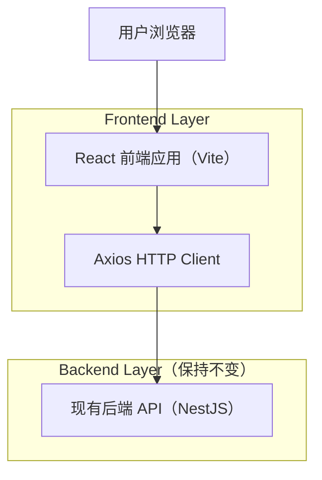

## 1.Architecture design


## 2.Technology Description
- Frontend: React@18 + antd@5 + react-router-dom@6 + axios + dayjs + TypeScript + vite
- Backend: NestJS（现有服务与接口保持不变）

## 3.Route definitions
| Route | Purpose |
|-------|---------|
| /login | 登录页 |
| /products | eBay 商品列表页（卡片瀑布流/网格） |
| /products/:id | 商品详情页（从列表点击进入；主要依赖路由 state 渲染，避免新增接口） |

## 4.API definitions
本需求不新增/不修改后端接口，仅复用现有接口。

### 4.1 Core API（保持不变）
获取 eBay 商品分页列表
```
GET /products/ebay
```
Query:
| Param Name| Param Type | isRequired | Description |
|-----------|------------|------------|-------------|
| keyword | string | false | SKU 或标题关键字 |
| page | number | false | 页码 |
| pageSize | number | false | 每页数量 |

Response（前端已存在的关键字段，示例）:
```ts
export interface EbayProduct {
  id: string;
  sku: string;
  title?: string | null;
  stockQty: number;
  price: string;
  currency: string;
  itemUrl?: string | null;
  syncedAt: string;
}
```

管理员触发同步（如现有）
```
POST /admin/sync/ebay-products
```

## 5.Server architecture diagram
不涉及新增服务端分层与交互，保持现有后端结构不变。

## 6.Data model
本需求不新增数据表、不调整数据模型。

### 前端实现关键点（不改后端）
- 列表页把 Table 渲染替换为卡片列表容器（CSS Grid/Columns 实现网格或瀑布流）。
- 点击卡片时通过 react-router `navigate('/products/:id', { state: { product } })` 将商品对象透传给详情页；详情页优先使用 `location.state` 渲染。
- 若详情页无 state（例如刷新/直达）：展示“无法获取商品信息”的空状态与“返回列表”按钮（不尝试新增获取详情的 API）。
- 图片策略：接口未提供图片字段时使用统一占位图；如后续接口补充 imageUrl，可无缝替换为真实图片。
