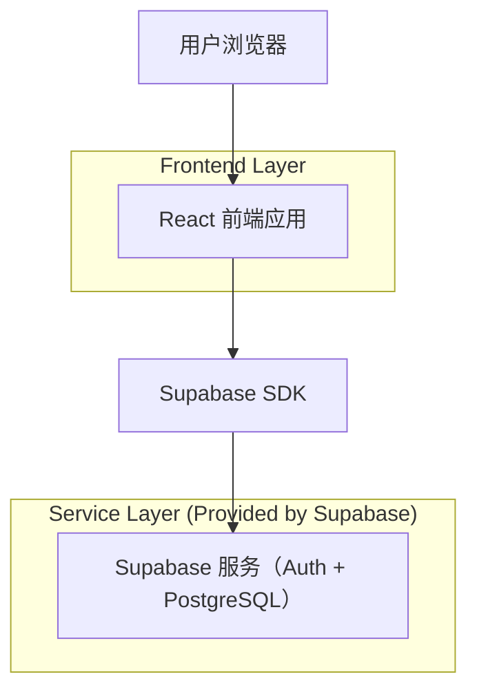
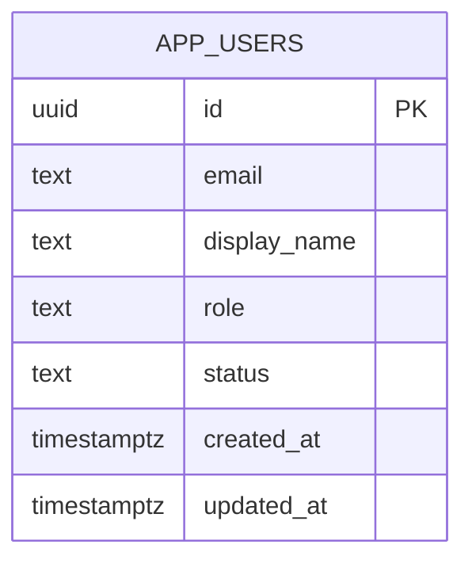

## 1.Architecture design


## 2.Technology Description
- Frontend: React@18 + TypeScript + React Router
- Backend: Supabase（Auth + PostgreSQL）

## 3.Route definitions
| Route | Purpose |
|-------|---------|
| /ebay/users | 用户管理页：仅管理员可访问；展示用户列表、搜索与分页 |

## 6.Data model(if applicable)

### 6.1 Data model definition


### 6.2 Data Definition Language
用户表（app_users）
```
-- create table
CREATE TABLE IF NOT EXISTS app_users (
  id UUID PRIMARY KEY,
  email TEXT,
  display_name TEXT,
  role TEXT NOT NULL DEFAULT 'user' CHECK (role IN ('user','admin')),
  status TEXT NOT NULL DEFAULT 'active' CHECK (status IN ('active','disabled')),
  created_at TIMESTAMPTZ NOT NULL DEFAULT NOW(),
  updated_at TIMESTAMPTZ NOT NULL DEFAULT NOW()
);

-- indexes for search & pagination
CREATE INDEX IF NOT EXISTS idx_app_users_email ON app_users (email);
CREATE INDEX IF NOT EXISTS idx_app_users_display_name ON app_users (display_name);
CREATE INDEX IF NOT EXISTS idx_app_users_created_at ON app_users (created_at DESC);

-- row level security
ALTER TABLE app_users ENABLE ROW LEVEL SECURITY;

-- helper function: current user is admin
CREATE OR REPLACE FUNCTION public.is_admin()
RETURNS BOOLEAN
LANGUAGE sql
STABLE
AS $$
  SELECT EXISTS (
    SELECT 1 FROM public.app_users u
    WHERE u.id = auth.uid() AND u.role = 'admin'
  );
$$;

-- policies: only admins can read user list
DROP POLICY IF EXISTS "admin_can_read_app_users" ON public.app_users;
CREATE POLICY "admin_can_read_app_users"
ON public.app_users
FOR SELECT
TO authenticated
USING (public.is_admin());

-- grants (RLS still applies)
GRANT SELECT ON public.app_users TO authenticated;
```

前端查询建议（用于“基础搜索/分页”）
- 权限：进入路由时先读取当前用户 profile/role（或调用 is_admin 逻辑对应的数据字段），不通过则路由守卫拦截。
- 列表：按 created_at DESC 排序；分页使用 range(from, to) 或 limit/offset。
- 搜索：对 email/display_name 做 ilike '%keyword%'（keyword 为空时返回默认列表）。
